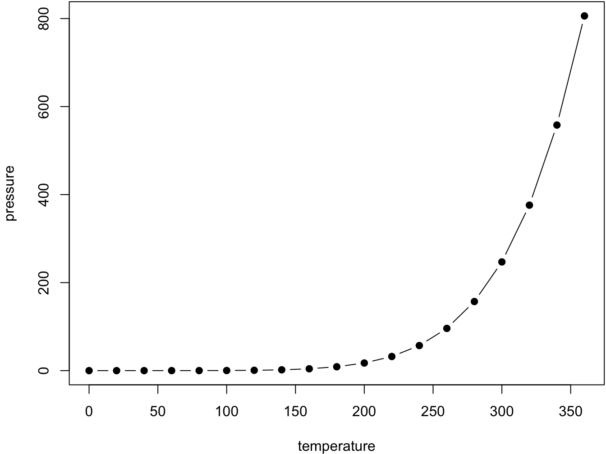

# Objectif de la formation {#intro}

<span style='color: red;'>Version provisoire et temporaire de la formation Insee 'Travail collaboratif avec R'</span>

## Objectifs de la formation

Cette formation vise à présenter la manière dont un projet collaboratif peut être mené avec `R` et la manière dont `Rstudio` facilite ce travail. L'objectif est d'apprendre les base du contrôle de version qui s'appuie sur le logiciel  `Git` et d'être autonome suite à cette formation. Accessoirement, cette formation donne quelques conseils pour mieux utiliser les projets RStudio qui sont devenus prédominants dans la communauté `R`. 


## Environnement

Dans ce cadre, le parti pris est l'utilisation de `R` via `RStudio`. Il s'agit
d'un choix peu suprenant puisque `RStudio` propose énormément de fonctionalités
favorisant l'utilisation de `R` en conjonction avec `Git`. 

**Il est important d'utiliser des projets RStudio plutôt que des scripts individuels**. 
Dans l'ensemble de cette formation, on va supposer qu'un projet R est mené via
un projet RStudio. Plus d'information sur les RProjects sont disponibles 
dans la documentation [utilitR](https://www.book.utilitr.org/). 

Cette formation peut être suivie dans n'importe quel environnement disposant de `RStudio` et `Git`. Cependant, des précisions sont parfois nécessaires pour tenir compte de certaines spécificités de l'architecture interne de l'Insee (environnement AUS, forge Gitlab interne). Elles sont faites lorsque nécessaires mais réduites au minimum possible.

<!--------------
You can label chapter and section titles using `{#label}` after them, e.g., we can reference Chapter \@ref(intro). If you do not manually label them, there will be automatic labels anyway, e.g., Chapter \@ref(methods).

Figures and tables with captions will be placed in `figure` and `table` environments, respectively.


```r
par(mar = c(4, 4, .1, .1))
plot(pressure, type = 'b', pch = 19)
```

<div class="figure" style="text-align: center">

<p class="caption">(\#fig:nice-fig)Here is a nice figure!</p>
</div>

Reference a figure by its code chunk label with the `fig:` prefix, e.g., see Figure \@ref(fig:nice-fig). Similarly, you can reference tables generated from `knitr::kable()`, e.g., see Table \@ref(tab:nice-tab).


```r
knitr::kable(
  head(iris, 20), caption = 'Here is a nice table!',
  booktabs = TRUE
)
```


Table: (\#tab:nice-tab)Here is a nice table!

| Sepal.Length| Sepal.Width| Petal.Length| Petal.Width|Species |
|------------:|-----------:|------------:|-----------:|:-------|
|          5.1|         3.5|          1.4|         0.2|setosa  |
|          4.9|         3.0|          1.4|         0.2|setosa  |
|          4.7|         3.2|          1.3|         0.2|setosa  |
|          4.6|         3.1|          1.5|         0.2|setosa  |
|          5.0|         3.6|          1.4|         0.2|setosa  |
|          5.4|         3.9|          1.7|         0.4|setosa  |
|          4.6|         3.4|          1.4|         0.3|setosa  |
|          5.0|         3.4|          1.5|         0.2|setosa  |
|          4.4|         2.9|          1.4|         0.2|setosa  |
|          4.9|         3.1|          1.5|         0.1|setosa  |
|          5.4|         3.7|          1.5|         0.2|setosa  |
|          4.8|         3.4|          1.6|         0.2|setosa  |
|          4.8|         3.0|          1.4|         0.1|setosa  |
|          4.3|         3.0|          1.1|         0.1|setosa  |
|          5.8|         4.0|          1.2|         0.2|setosa  |
|          5.7|         4.4|          1.5|         0.4|setosa  |
|          5.4|         3.9|          1.3|         0.4|setosa  |
|          5.1|         3.5|          1.4|         0.3|setosa  |
|          5.7|         3.8|          1.7|         0.3|setosa  |
|          5.1|         3.8|          1.5|         0.3|setosa  |

You can write citations, too. For example, we are using the **bookdown** package [@R-bookdown] in this sample book, which was built on top of R Markdown and **knitr** [@xie2015].
------>
