# Utiliser `GIT` avec <i class="fab fa-r-project"></i>{#git}


Cette formation ne nécessite pas de connaissances avancées en `R`, voire aucune car elle s'appuie uniquement sur les fonctionnalités de `RStudio`. À toute fin utile, la documentation [utilitR](www.book.utilitr.org) constitue une ressource
qu'il peut être intéressant de consulter en complément. 


## Pourquoi utiliser la gestion de version ?

Nos travaux statistiques évoluent constamment (productions annuelles, nouvelles enquêtes, etc.) et nous travaillons souvent à plusieurs. En outre, le maintien de la qualité de nos chaînes de traitement nécessite un archivage détaillé et facilement accessible. 

Tous les statisticiens se sont déjà demandé (ou à leurs collègues) : 

* quelle était la bonne version d'un programme 
* qui était l'auteur d'un bout de code en particulier
* si un changement était important ou juste un essai
* comment fusionner des programmes
* etc.

Souvent l'organisation des programmes partagés est une gageure et ressemble à une longue liste d'archivages manuels et arbitraires.

**Exemple d'une organisation de fichiers à l'ancienne**
{width=100%}  

Pourtant, il existe un outil informatique puissant afin de répondre à tous ces besoins : la gestion de version (*version control system* (VCS) en anglais). Ses avantages sont incontestables et permettent de facilement :

* enregistrer l'historique des modifications d'un ensemble de fichiers 
* revenir à des versions précédentes d'un ou plusieurs fichiers
* rechercher les modifications qui ont pu créer des erreurs
* partager ses modifications et récupérer celles des autres
* proposer des modifications, les discuter, sans pour autant modifier la dernière version existante
* identifier les auteurs et la date des modifications

En outre, ces outils fonctionnent avec tous les langages informatiques (texte, R, Python, SAS, $\LaTeX$, Java, etc.) car reposent sur la comparaison des lignes et des caractères des programmes, indépendamment du langage.

En bref, c'est **LA** bonne manière pour partager des codes et travailler à plusieurs sur un projet statistique (études ou production).

### Conserver et archiver du code

Une des principales fonctionnalités de la gestion de version est conserver l'ensemble des fichiers de façon sécurisée et de proposer un archivage structuré des codes. Les fichiers sont stockés dans un **dépôt**, qui correspond au projet (par exemple, le modèle Ines). C'est là où sont stockéees toutes les informations utiles au partage des codes.

Dans la gestion de version, tout repose dans la comparaison des changements dans les programmes et la présentation de l'historique de ces modifications. Chaque modification (ajout, suppression ou changement) sur un ou plusieurs fichiers est identifiée par son auteur, sa date et un bref descriptif^[Plus précisément, chaque modification est identifiée de manière unique par un code `SHA` auquel est associé l'auteur, l'horodatage et des méta-données (par exemple le message descriptif associé)]. Chaque changement est donc unique et aisément identifiable quand ils sont classés par ordre chronologique par exemple. Les modifications transmises au dépôt commun sont appelées **commit**. Cette étape joue un rôle central et sera détaillée plus loin.

**Un exemple d'historique d'un projet sur GitLab issu du projet [utilitR](https://gitlab.com/linogaliana/documentationR/-/commits/master/)**
{width=100%}  

**Un exemple d'historique d'un projet via RStudio**
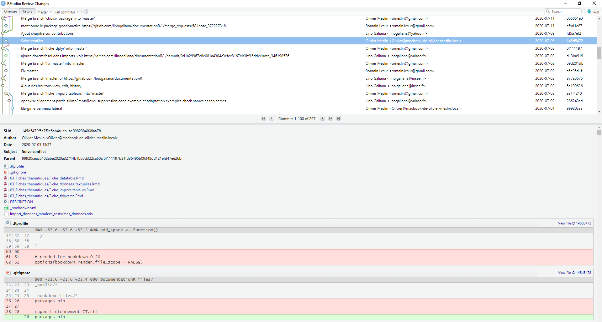{width=100%} 

Avec la gestion de version, sur son poste de travail, les dizaines (centaines ?) de programmes organisés à la main n'existent plus. Tout est regroupé dans un seul dossier, rassemblant les éléments du dépôt à une date donnée, généralement la plus récente. Au sein du dépôt, tout l'historique est stocké et accessible rapidement. Si l'on souhaite travailler sur la dernière version des programmes (ou sur une ancienne version spécifique), il n'y a plus besoin de conserver les autres fichiers car ils sont dans l'historique du projet. Il est alors possible de choisir sur quelle version on veut travailler (la dernière commune à tout le monde, la sienne en train d'être développée, celle de l'année dernière, etc.).

### Travailler efficacement en équipe

Le deuxième avantage de la gestion de version représente une amélioration notable du travail en équipe sur des codes en commun. Que ce soit au sein d'un modèle cogéré (Ines, Destinie, etc.), de gros projets (Nautile) ou de chaînes de traitement récurrentes (enquête emploi, comptes trimestriels, etc.), la collaboration est courante lors des travaux statistiques. La gestion de version permet de collaborer simplement et avec méthode. De façon organisée, elle permet de:

* travailler en parallèle et fusionner facilement du code
* partager une documentation des programmes grâce :
    + aux commentaires des modifications
    + à la possibilité d'une documentation commune et collaborative
* trouver rapidement des erreurs et en diffuser rapidement la
correction

**Exemple de détails d'une modification**
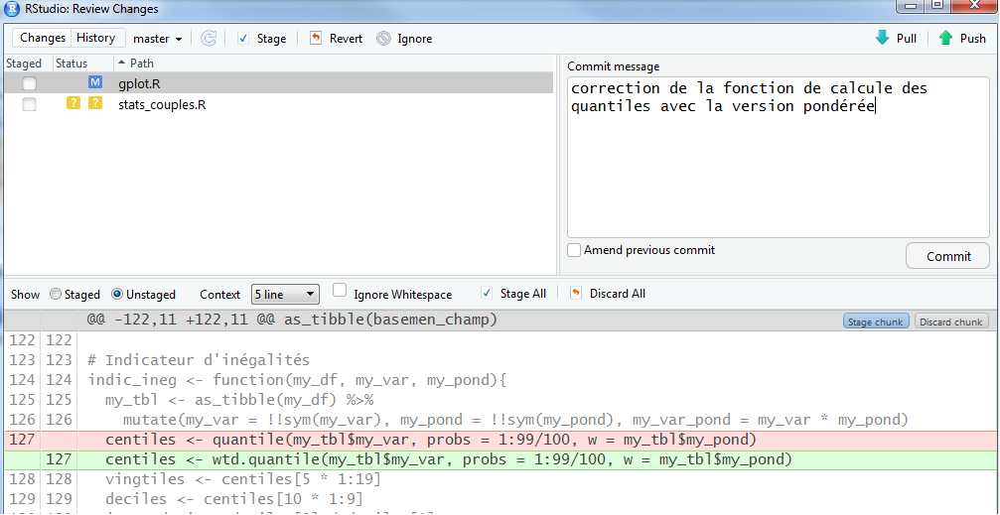{width=100%} 

:::: {.remarque data-latex=""}


L'usage individuel, c'est-à-dire seul sur son projet, permet aussi de "travailler en équipe avec soi même" car il permet de retrouver des mois plus tard le contenu et le contexte des modifications. Cela est notamment précieux lors des changements de poste ou des travaux réguliers mais espacés dans le temps (par exemple, un mois par an chaque année).

Même en travaillant seul sur un projet, on collabore avec un *moi* futur (qui aura vraisemblablement oublié le contenu ou la raison de la modification des fichiers). Donc il est également recommandé de travailler en gestion de version sur un projet individuel.

::::


### Améliorer la qualité des codes

Le fonctionnement de la gestion de version, reposant sur l'archivage structuré des modifications et les commentaires les accompagnant, renforce la qualité des programmes informatiques. Ils sont plus documentés, plus riches et mieux structurés. C'est pour cette raison que le contrôle de version est un outil puissant pour toute production statistique : toute personne travaillant sur des programmes, `SAS` y compris, gagne à utiliser du contrôle de version. 

Quand il s'agit de modèles statistiques, ou de chaînes de traitement statistique, constitués de nombreux programmes, la gestion de version permet :

* l'amélioration de la qualité des modèles par des méta-données riches, 
* un gain de place pour stocker les historiques,
* leur diffusion simplifiée et harmonisée. 

En outre, lors de l'ouverture des modèles au format *open source* par exemple, leur diffusion publique correspond aux standards des communautés de logiciels libres et aux usages recommandés pour documenter des programmes informatiques. Cela permet aux utilisateurs ou aux agents découvrant des chaînes de traitement de mieux s'approprier les programmes.

### Usage quotidien : un exemple avec le modèle Ines

Le modèle Ines est co-développé par l'Insee et la Drees ainsi que la Cnaf depuis 2018. Sous licence libre, il est disponible en *open-source*. Il est organisé dans une *forge* qui regroupe le code, un wiki, une documentation, un forum et différents outils collaboratifs (ces éléments seront présentés [plus loin](#gitlab)). Les utilisateurs y ont accès via la [plateforme Adullact](https://adullact.net/projects/ines-libre). Le dépôt regroupe donc les programmes, l'historique des modifications et les archives des différentes versions ('Ines 2018' par exemple). Les chargés d'étude ont une copie locale du projet sur leur poste de travail. Les changements sont mis à jour et disponibles en temps réel. 

**Envoi d'une modification avec TortoiseSVN : commit**

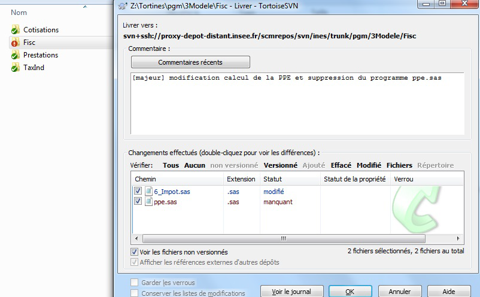{width=100%}   

**Historique d’un fichier ou dossier : log**
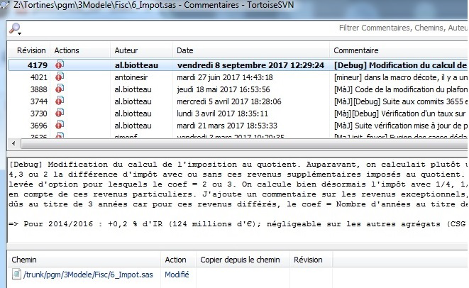{width=100%}  

**Recherche efficace une erreur : blame**
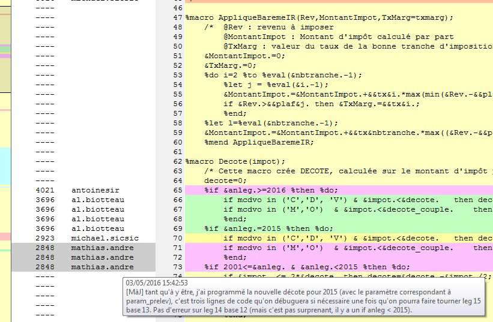{width=100%}  

D'une manière générale, il existe plusieurs manières d'utiliser le contrôle de version : 

* en ligne de commande, via [git bash](https://gitforwindows.org/), par exemple ;
* avec une interface graphique spécialisée, par exemple [tortoise git](https://tortoisegit.org/) ou [GitHub Desktop](https://desktop.github.com/) ;
* avec un logiciel de développement : la plupart des logiciels de développement ([RStudio](https://rstudio.com/) pour `R`, [PyCharm](https://www.jetbrains.com/fr-fr/pycharm/) ou [jupyter](https://jupyter.org/) pour `python`, [atom](https://atom.io/), etc.) proposent tous des modules graphiques facilitant l'usage de `git` dont les fonctionnalités sont très proches.

Dans ce support, nous présentons le contrôle de version via `RStudio`, la solution que nous recommandons en raison de sa simplicité. Elle rend le recours à la ligne de commande marginal voire inutile. Elle est également plus rapide et facilement implémentable à l'Insee.

### Avec ou sans gestion de versions

Le tableau suivant compare les usages au temps (pré-historique ?) de la programmation sans gestion de version avec les modes de travail si on y a recours :

|                      |      Avant            |  Gestion de version  |
|:---------------------|----------------------:|---------------------:|
|Archivage             | à la main             | automatique          |
|Envoi de modification | mail, dossier partagé | code partagé         |
|Fusion de code        | copié-collé           | simple, sûr          |
|Versions du modèle    | dossiers archivés     | historique riche     |
|Gestion des erreurs   | à la main             | méthodique           |
|

Beaucoup de supports existent en ligne, il faut parfois s'en méfier car les usages peuvent différer et sont souvent spécifiques aux usages et aux installations (cf. *infra*). Cette présentation [*Git for humans*](https://speakerdeck.com/alicebartlett/git-for-humans) didactique courte mais en anglais présente les avantages de l'usage de `GIT`.

En conclusion, que ce soit au sein d'un travail collaboratif en équipe ou sur ses propres projets individuels, notre temps est consacré à la programmation réellement utile. Plus de temps perdu ! L'organisation du travail est efficace grâce :

* aux améliorations rapides des codes
* au partage efficace des tâches
* à la recherche puissante des erreurs
* à un archivage géré automatiquement avec des méta-données
* à des outils généralisés et documentés en ligne.

La gestion de version est donc le meilleur moyen de partager du code (entre équipes internes,
lors des changements de poste, pour l'archivage, lors de l'ouverture au libre, etc.). Ces outils viennent du développement informatique et de la création des logiciels et applications. Les traitements statistiques sont également des chaînes informatiques et sont donc pleinement adaptés pour s'appuyer sur les outils de gestion de version.

## Configurer un projet `GIT` avec RStudio à l'Insee

Dans une configuration classique, la première étape consisterait à installer le logiciel `GIT` sur son poste. C'est par exemple le cas sur son ordinateur personnel ou sur son poste de travail local. Cependant, cette formation adopte un cadre de travail sécurisé et partagé, permettant à la fois d'utiliser la version de `RStudio` recommandée et d'avoir accès aux coffres. Elle peut se dérouler  sur le serveur de calcul AUS interne à l'Insee ou sur le [datalab du SSP](https://datalab.sspcloud.fr). C'est aussi certainement le cadre de travail classique sur des projets collaboratifs avec d'autres collègues. Ce support présente la configuration spécifique à AUS comme cadre par défaut mais fournit également des éléments pour le cas d'un projet sur poste local. 

La seconde brique afin de pouvoir travailler sur un projet partagé est le choix de la plateforme où est stocké le `repository`. Cela peut être sur `github.com`, `gitlab.com` ou une autre forge en ligne. À l'Insee, il est recommandé de s'appuyer sur le [`GitLab` interne](https://gitlab.insee.fr). 

Que ce soit sur les sites externes de type `gitlab.com` ou la plateforme innovation, il est d'abord nécessaire de créer son accès puis ensuite de configurer l'acccès au `GitLab`. Ces manipulations sont à faire une et une seule fois pour un poste de travail donné, ce sont les étapes de configuration. Ensuite, les manipulations pour accéder à un projet déjà existant sont plus simples et automatisées. 

### La première fois

La section qui suit présente l'étape fondamentale pour pouvoir lire et modifier un dossier partagé sur un dépôt commun stocké sur un `GitLab`. Cette plateforme est un outil de stockage et de gestion des projets mis en commun via `Git`. 

#### Accéder au `GitLab` de l'Insee

Une version interne de `GitLab` est disponible à l'Insee sur [gitlab.insee.fr](https://gitlab.insee.fr).  Pour accéder à son profil sur le  `GitLab` de l'Insee, il est nécessaire de se connecter avec son profil individuel. Pour y accéder, il suffit de cliquer sur `Sign In` en haut à droite: 

{width=100%} 

#### Recommandation concernant l'authentification HTTPS vs SSH

L'étape suivante de configuration est de créer un lien sécurisé entre le profil utilisateur distant et le poste de travail (local ou AUS). Pour cela, il existe deux possibilités l'authentification via `HTTPS` ou via `SSH`.

En dehors des infrastructures Insee, il est généralement plus simple d'utiliser l'authentification `HTTPS` que `SSH`, notamment lorsqu'on interagit avec `Gitlab.com` car il suffit de rentrer `login/password` lorsqu'on interagit avec un dépôt. La fiche [utilitR](https://www.book.utilitr.org/git-config.html) présente avec plus de détails ces concepts et des recommandations de sécurité adaptées, par exemple sur la manière d'enregistrer un jeton `HTTPS`  pour ne pas avoir à le fournir à chaque authentification ou pour utiliser l'authentification SSH.

À l'Insee, le [wiki d'`AUSV3`](https://gitlab.insee.fr/infrastructure/lss/ausv3/documentation-utilisateurs/-/wikis/Logiciels/Git) décrit toutes les étapes (à suivre à la lettre et pas à pas) pour configurer l'utilisation de `Git` avec AUS par l'intermédiaire `SSH`. Cette manipulation tient lieu d'installation pour pouvoir échanger avec le dépôt distant et est donc à faire une seule fois par poste (local, AUS ou personnel en dehors des projets Insee).

### Au lancement de chaque projet, cloner depuis `gitlab.insee.fr`

Pour pouvoir récupérer un projet disponible sur un dépôt afin de le modifier en local, la première étape consister à récupérer le chemin du dossier partagé, afin de le copier dans son espace de travail (dit local). Il est disponible via le bouton `clone` du projet. 

Prenons l'exemple du support de cette formation, créé avec `RStudio` et `GIT` sur la plateforme innovation. Pour récupérer (**<abbr title="Serveur distant ayant une copie de repository"><b>clone</b></abbr>** en vocabulaire `GIT`) le dossier partagé, il suffit copier l'adresse indiquée sous la boîte *Clone with SSH* avec l'icône entourée.


Ensuite, il est nécessaire d'indiquer à `RStudio` comment se connecter à ce dépôt distant (stocké sur le `Gitlab`). Dans "File / New Project", sélectionner `Version control` puis `GIT` :  

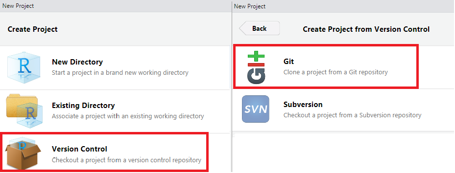 

Il suffit ensuite de remplir les trois paramètres : 

* *Repository URL* : coller l'adresse `SSH` copiée depuis le `GitLab`
* *Projet directory name* : le nom du dossier où va sera la copie locale du `repository`, c'est là où vous allez modifier les programmes et où se situera votre code
* *Create project as subdirectory of* : le chemin physique où se situera le projet, par exemple `D:/idep` dans le cas d'un projet local.

Cliquer sur `Create project` copier les fichiers du dossier partagé et vous permet de travailler sur `RStudio` avec l'interface `GIT` qui va être décrite dans la partie suivante.

Il est également possible de cloner des dépôts en externe via `https` par exemple. Si vous rencontrez des problèmes pour configurer un dépôt, une [vidéo d'installation](http://formation-git-sndi-lille.pages.innovation.insee.eu/installation-git/ ) a été produite par le SNDI ainsi qu'une [documentation de configuration](https://git.stable.innovation.insee.eu/formation-git-sndi-lille/installation-git). 


## Des bases de GIT <i class="fas fa-code-branch"></i>

Les deux outils de gestion de version les plus répandus sont GIT et SVN (pour Subversion). L'Insee a utilisé SVN pendant un temps mais privilégie GIT maintenant en raison de plusieurs avantages, comme le travail hors ligne plus stable, une meilleure flexibilité et une plus grande vitesse (cf. infra).

GIT est un logiciel qui est installé sur son poste et celui de ses collaborateurs. Il est open source, gratuit et très répandu. Ainsi, une vaste documentation est disponible en ligne ou les forums d'entraide de type `stackoverflow` (voir par exemple le tag ['GIT'](https://stackoverflow.com/questions/tagged/git) ). Sur la plateforme `GitHub`, la [page de tutoriel](http://try.github.io/) regroupe différents supports. Des vidéos pédagogiques sont fournies sur [git-scm.com](https://git-scm.com/videos).

:::: {.conseil data-latex=""}

Face au foisonnement des pratiques et des ressources en ligne, il est recommandé d'adopter et suivre les bonnes pratiques pour chaque projet, et de prendre avec vigilance ce qui est trouvé en ligne. Les configurations et les habitudes diffèrent et une solution proposée sur un forum ou dans un livre peut ne pas être adaptée dans votre cas précis. 

C'est l'objectif de ce support de rassembler les pratiques les plus courantes et présenter l'utilisation recommandée de la gestion de version avec RStudio à l'Insee.

::::


La genèse de Git correspond au noyau du système d'exploitation Linux qui gérait les patchs et les archives pendant les années 1990. À partir de 2005, Linus Torvalds, aussi inventeur de Linux, développe un successeur avec pour objectifs, la vitesse, la simplicité, la possibilité de développements en parallèle (les futures **<abbr title="Ligne de développement parallèle au sein du dossier"><b>branche</b></abbr>s**), le tout avec un usage compact des données. Depuis, son usage a largement dépassé celui de SVN.


:::: {.remarque data-latex=""}
SVN est dit centralisé alors que GIT est dit distribué. Cela signifie notamment que chaque collaborateur possède une copie en propre de l'ensemble du projet sur son poste de travail. Cela implique un avantage important de GIT en terme de sécurité des codes (qui risquent beaucoup moins d'être perdus) et la  rapidité des partages des modifications.

En outre, contrairement à SVN pour lequel il faut être connecté à un serveur, il n'est pas besoin d'être connecté avec GIT et on peut travailler en local. Ainsi, on transmet ses modifications quand on le souhaite ou peut et cela facilite le travail distant.
::::

Enfin, un des grands avantages pratiques de `GIT` est son intégration native dans l’interface `RStudio` (et réciproquement) ainsi que dans les plateformes `GitHub` et `GitLab` (voir parties ci-après). À l'origine utilisé en ligne de commandes (et utilisé comme tel par les développeurs), les interfaces graphiques actuelles permettent de s'en passer dans l'immense majorité des situations.


### Le B.A-BA

Les programmes s’organisent sur un répertoire distant commun
(dépôt ou <abbr title="Dossier partagé qui contient toutes les informations"><b>repository</b></abbr>) et sont manipulés sur les postes indidivuels dans des
dossiers locaux (**working directory**). Le dépôt distant peut par exemple être hébergé sur une plateforme de type **GitLab** <i class="fab fa-gitlab"></i> ou **GitHub** <i class="fab fa-github"></i>.

:::: {.remarque data-latex=""}

**GitHub, GitLab, quesaquo ?**

Le travail collaboratif avec `Git` s'organise autour d'un serveur auquel chaque contributeur transmet ses modifications et depuis lequel les différents contributeurs récupèrent le travail des collègues.

Comme tout serveur, ceux-ci peuvent être accessibles sur un réseau interne ou être accessibles sur internet. Sur ces serveurs, on installe un logiciel qui offre une interface utilisateur. Il existe différents types d'interface utilisateur, les deux plus populaires s'appelant "GitHub" ou "GitLab".

Dans le contexte de travail de l'Insee, vous pourrez être amenés à travailler avec différents serveurs que nous différencions ici grâce à leurs adresses web : 

- [gitlab.insee.fr](https://gitlab.insee.fr) : serveur interne au réseau de l'Insee avec une interface utilisateur de type "GitLab" maintenu par la DSI de l'Insee (projet SOFA)
- [git.lab.sspcloud.fr](https://git.lab.sspcloud.fr) : serveur du SSP Cloud exposé sur internet avec une interface utilisateur de type "GitLab" maintenu par la division innovation
- [github.com](https://github.com) : serveur public exposé sur internet avec une interface utilisateur de type "GitHub" maintenu par Microsoft
- [gitlab.com](https://gitlab.com) : serveur public exposé sur internet avec une interface utilisateur de type "GitLab" maintenu par l'entreprise GitLab

Tous les serveurs `Git` connaissent une structure similaire : 

- chaque utilisateur possède un espace personnel pour stocker ses projets. Par exemple, sur le serveur GitLab de l'Insee, chaque agent a un espace accessible à l'adresse <https://gitlab.insee.fr/IDEP>
- il est possible de créer des espaces communs pour une structure ou pour un projet donné. Par exemple, l'Insee dispose d'un espace institutionnel sur GitHub nommé <https://github.com/InseeFr> qui héberge des projets open source de l'Insee utilisés en production ainsi qu'un espace pour les projets open source expérimentaux nommé <https://github.com/InseeFrLab>  

::::


Les trois manipulations les plus courantes sont les suivantes et représentées sur le diagramme ci-après : 

+ <abbr title="Récupération des nouveaux commits en local depuis le remote"><b>pull</b></abbr> : je récupère la dernière version des codes du dépôt distant
+ <abbr title="Modification validée à un instant donné, par extension état du projet à cet instant"><b>commit</b></abbr> : je valide mes modifications avec un message qui les expliquent
+ <abbr title="Envoi de ses nouveaux commit vers le remote"><b>push</b></abbr> : je transmets mes modifications validées au dépôt distant


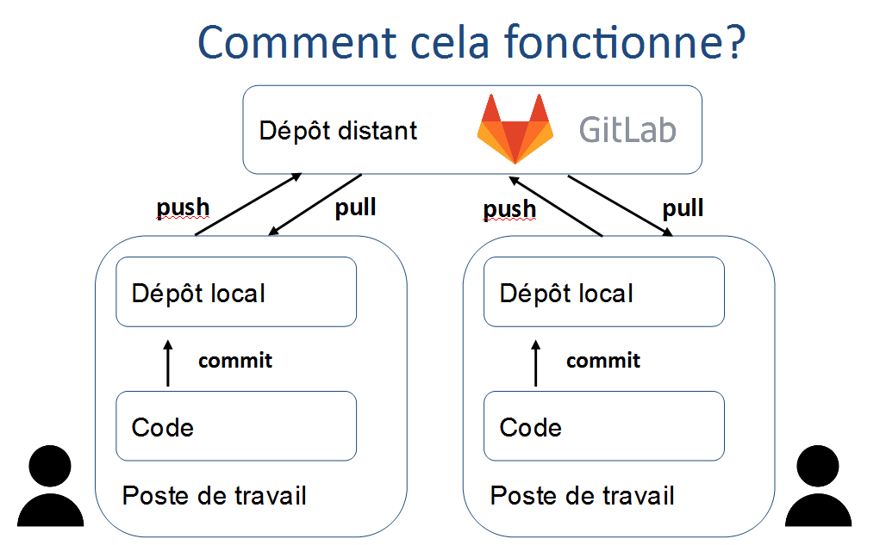{width=100%} 

De manière plus précise, il y a trois étapes avant d'envoyer les modifications validées (<abbr title="Modification validée à un instant donné, par extension état du projet à cet instant"><b>commit</b></abbr>) au dépôt. Elles se définissent en fonction des commandes qui permet de les appliquer quand Git est utilisé en ligne de commandes :

* `diff` : inspection des modifications. Cela permet de comparer les fichiers modifiés et de distinguer les fichiers ajoutés ou supprimés
* `staging area` : sélection des modifications. 
* <abbr title="Modification validée à un instant donné, par extension état du projet à cet instant"><b>commit</b></abbr> :  validation des modifications sélectionnées (avec commentaire).

L'un des intérêts de `git` est que le choix des modifications à soumettre est très fin: il est possible de découper les modifications d'un fichier en plusieurs morceaux cohérents. 

Les deux diagrammes ci-dessous représentent ces différences étapes et les commandes qui permet de passer d'un état à l'autre.

{width=100%} 

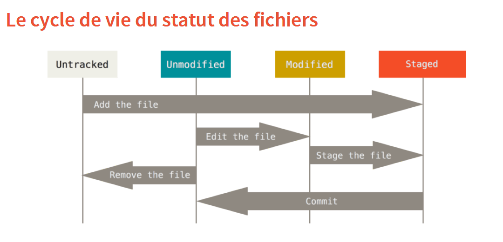{width=100%} 


Lors d'un <abbr title="Modification validée à un instant donné, par extension état du projet à cet instant"><b>commit</b></abbr>, le message de validation est très important:

* il décrit brièvement les modifications contenues dans le commit
* il s'adresse aux autres et doit donc être intelligible

Chaque commit doit rassembler des modifications homogènes. Il ne faut donc pas hésiter à séparer les changements qui ne sont pas directement reliés car il est plus facile de rechercher au sein de plusieurs modifications différentes qu'une seule trop vaste.

Chaque <abbr title="Modification validée à un instant donné, par extension état du projet à cet instant"><b>commit</b></abbr> est identifié de façon unique par un <abbr title="Identifiant unique pour chaque commit, contenant notamment un horodatage"><b>hash</b></abbr> (ex: `441300764de91c376`), un numéro peu intelligible pour un humain mais qui permet au système de contrôle de version de gérer proprement chaque modification.

Ensuite, les deux fonctions <abbr title="Envoi de ses nouveaux commit vers le remote"><b>push</b></abbr> et <abbr title="Récupération des nouveaux commits en local depuis le remote"><b>pull</b></abbr> permettent la mise à jour du projet local par rapport au distant et réciproquement. C'est donc avec un <abbr title="Envoi de ses nouveaux commit vers le remote"><b>push</b></abbr> qu'on envoie les modifications qui ont été sélectionnées puis validées.

Lors des étapes de push et pull, des **conflits** peuvent apparaître, par exemple lorsque deux personnes ont modifié le même programme simultanément. 

Tout d'abord, il est possible de minimiser l'apparition de conflits en amont en validant souvent les modifications (`commit`) :

* en commençant par mettre à jour sa copie locale régulièrement via <abbr title="Récupération des nouveaux commits en local depuis le remote"><b>pull</b></abbr> ou <abbr title="Mise à jour du dépôt local par rapport à l'état du dépôt distant, sans procéder à la fusion"><b>fetch</b></abbr>, voire dès qu'on commencer à travailler sur un projet
* en regroupant les commit par petits lots homogènes et en préférant peu de fichiers
* en communiquant avec les autres membres de l’équipe en disant sur quoi on travaille et en prévenant en cas de grosse modification


:::: {.recommandation data-latex=""}

De manière générale, **il ne faut pas avoir peur des conflits**. Les outils sont faits pour les gérer avec rigueur et méthode (voir [les exercices](#gitexo)). Avec GIT, il est très rare de faire des bêtises et on peut toujours réparer **à condition de s'en tenir aux commandes de base** (<abbr title="Modification validée à un instant donné, par extension état du projet à cet instant"><b>commit</b></abbr>, <abbr title="Envoi de ses nouveaux commit vers le remote"><b>push</b></abbr>, <abbr title="Récupération des nouveaux commits en local depuis le remote"><b>pull</b></abbr> et <abbr title="Fusion de une ou plusieurs branches"><b>merge</b></abbr>).

Cependant, **il existe des commandes qui peuvent définitivement endommager votre projet**, la plus destructrice étant `git push --force` que vous ne devriez jamais utiliser. Faites très attention en lisant des tutoriels en ligne car certains sont à destination d'utilisateurs avancés et recommandent ces commandes "à risque". 

::::


### Exercice 1: Premiers pas avec `git` en local {#gitlocal}

Dans le cadre de cette formation, un projet d'exemple a été créé pour vous. L'idée est de former des groupes de deux, chaque groupe représentant une équipe. Vous allez donc travailler en binôme avec votre voisin (ou avec une personne de la visio si la formation n'a pas lieu en présentiel).

Dans cette partie, nous allons adopter un fil rouge en créant un document collaboratif commun et en pratiquant par des exercices les principales situations d'un statisticien qui travaille avec `R` et `GIT` via `RStudio` et `GitLab`.

:::: {.recommandation data-latex=""}

**Préliminaire: forker le projet** Même si c'est techniquement possible, être plus de 10
à faire des modifications en simultané sur la branche `master` est périlleux. Il convient
donc d'éviter d'être tous en même temps sur le même projet.

Pour cela, dans chaque équipe
de 2, une personne doit faire un <abbr title="Copie d'un projet disponible sur un dépôt distant permettant de modifier un projet sans affecter le dépôt d'origine"><b>fork</b></abbr> qui revient à dupliquer le projet pour chacune des équipes. Pour cela, il faut cliquer en haut à droite du projet exemple, qui sert de base à l'exercice.

La personne qui a initié le `fork` (pas besoin d'être deux à le faire) doit
ensuite donner des droits à son/sa binôme (dans `members` du menu à gauche ). Accorder le droit de `maintainer` pour commencer.

::::

:::: {.exo data-latex=""}
Exercice 1 : Git en local

⚠️ N'oubliez pas qu'il faut avoir fait un `fork` du projet.


Pour commencer, tout se passe dans l'onglet `git` de `RStudio` (en haut à droite) : 


**Question a.** *`clone` et modification du fichier`.gitignore`*

Clôner le dossier de votre projet d'équipe avec `RStudio` via le lien `SSH` du projet sur `Gitlab`. Ensuite, modifier le fichier `.gitignore` en y ajoutant les fichiers `.pdf` et au `.html`. Penser à sauvegarder le fichier.  

**Question b.** *`staging`*

Créer un fichier `votre_idep.md` et y écrire une phrase au format, sujet-verbe-complément mais majuscule ni ponctuation. Observer le statut du fichier dans l'onglet `git`.

**Question c.** *`commit`*

Valider cet ajout via le bouton `commit` en ajoutant un message clair mais bref.

**Question d.** *`push`*
    
Envoyer cette modification au projet partagé via le bouton `push` (flèche verte montante).
:boom: Un des deux membres du groupe (celui qui a été moins rapide) devrait avoir un rejet
du `push`. Pas de problème, passer à l'étape suivante (`pull`) puis refaire cette étape (`push`)

**Question e.** *`pull`*

Récupérer les modifications du dépôt commun (= le fichier de votre voisin à ce stade) via le bouton `pull` (flèche bleue descendante).

**Question f.** *`commit-push-pull`*

Recommencer les mêmes opérations modifiant cette fois-ci le fichier de votre voisin. Compléter le texte par une autre phrase.

:::: 


### Les branches : principes

C'est une des fonctionnalités les plus pratiques de la gestion de version. La création de  dans un projet (qui devient ainsi un arbre) permet de développer en parallèle des correctifs ou une nouvelle fonctionnalité sans modifier le dépôt commun. Cela permet de séparer le nouveau développement et de faire cohabiter plusieurs versions, pouvant évoluer séparément ou pouvant être facilement rassemblées. Git est optimisé pour le travail sur les branches.

<blockquote class="twitter-tweet"><p lang="fr" dir="ltr">Petite révélation du jour : <a href="https://twitter.com/hashtag/git?src=hash&amp;ref_src=twsrc%5Etfw">#git</a>, c&#39;est le meilleur outil pour te rappeler que nous sommes proches des singes : si t&#39;es pas sur une branche, t&#39;es dans la merde</p>&mdash; Nicolas Delsaux (\@riduidel) <a href="https://twitter.com/riduidel/status/1229768054109855747?ref_src=twsrc%5Etfw">February 18, 2020</a></blockquote> <script async src="https://platform.twitter.com/widgets.js" charset="utf-8"></script> 


Les branches peuvent avoir des durées de vie plus ou moins longues selon leurs objectifs : nouvelle fonctionnalité, résolution de bugs, environnement de développement ou de production, etc.

Trois principales fonctionnalités existent, définies par leur nom de commande :

* `git branch` : création d'une branche
* `git checkout` : pour changer de branche
* `git merge` : fusion de branche

Dans un projet collaboratif, une branche dite **master** joue le rôle du tronc. C'est autour d'elle que vont pousser ou se greffer les branches comme le montre l'exemple ci-dessous.

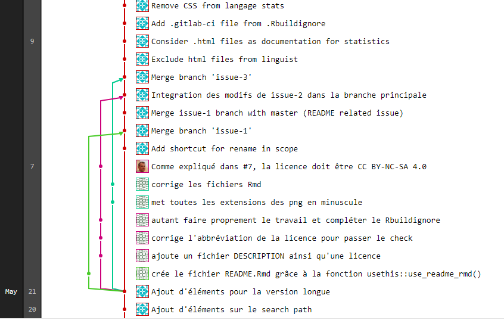{width=100%} 

### Branches et lien avec `master`

La branche `master` est la branche principale. Elle se doit d'être "propre".
On ne pousse pas des travaux non aboutis sur `master`, c'est assez mal vu et sources de futurs problèmes.  

Peut-on pousser directement sur `master` ? Oui, pour des petites corrections, des modifications mineures dont vous êtes certains qu'elles vont fonctionner. Mais sachez que dans le cadre de projets sensibles, c'est strictement interdit. Il y a justement des meilleurs outils pour proposer des changements substantiels. Dans votre organisation, n'ayez pas peur de fixer comme règle l'interdiction de pousser sur `master`
(cf. [section précédente](#orgagit)), cela obligera l'équipe
projet à travailler avec rigueur. 

Au moindre doute, créez une branche ! Les branches sont utilisées pour des travaux significatifs :

- vous travaillez seul sur une tâche qui va vous prendre plusieurs heures ou jours de travail (vous ne devez pas pousser sur `master` des travaux non aboutis);
- vous travaillez sur une fonctionnalité nouvelle et vous souhaiteriez recueillir l'avis de vos collègues avant de modifier `master`;
- vous n'êtes pas certain de réussir vos modifications du premier coup et préférez faire des tests en parallèle.

:::: {.recommandation data-latex=""}

⛔ Les branches ne sont pas personnelles : **Toutes les branches sont publiées, le <abbr title="Déplacement des commits d'une branche vers une autre. C'est une pratique dangereuse, à éviter !"><b>rebase</b></abbr> est interdit. Le <abbr title="Envoi de ses nouveaux commit vers le remote"><b>push</b></abbr> force est également interdit.** 

⛔ **Tous les merges dans `master` doivent se faire par l'intermédiaire d'une merge request dans `GitLab`**. En effet, il est très mal vu de merger une branche dans master localement.

::::

Comment nommer les branches ? Là encore, il y a énormément de conventions différentes. Une fréquemment observée est :

- pour les nouvelles fonctionnalités : `feature/nouvelle-fonctionnalite` où `nouvelle-fontionnalite` est un nom court résumant la fonctionnalité
- pour les corrections de bug : `issue-num` où `num` est le numéro de l'issue
- pour les branches liées à une issue: `num-blabla` où `num` est le numéro de l'issue et `blabla` un titre permettant de comprendre l'objet de la merge request.

N'hésitez pas à aller encore plus loin dans la normalisation  !


Jusqu'à présent, vous ne travailliez pas simultanément sur un fichier. Les conflits
étaient donc limités. A partir de maintenant, vous allez découvrir l'une des
forces de `Git`: on peut travailler sur le même fichier en même temps. 

:::: {.exo data-latex=""}
Exercice 2 : Cadavre exquis


**Question a.** *Création d'une branche locale*

Placez-vous sur la branche `master` dans votre dépôt local.
Créez une branche dans le dépôt local, en lui donnant un nom comportant votre prénom.

**Question b.** *Modification au sein d'une branche*

Ouvrez (ou créez) le fichier `cadavre_exquis.md` dans le dépôt local, et ajoutez-y deux phrases sans aucune ponctuation. Sauvegardez cette modification en faisant un `commit`. N'oubliez pas de rédiger un message le plus clair possible.

**Question c.** *Publication d'une branche*

Poussez votre branche vers le dépôt commun (avec `push`).

**Question d.** *Récupération de la branche créée par votre voisin*

Récupérez la branche créée par votre voisin (avec `pull`).

**Question e.** *Modifier une autre branche*

Placez-vous sur la branche créée par votre voisin. Ouvrez le fichier `cadavre_exquis.md` figurant dans votre dépôt local. Vous devez normalement voir les deux phrases écrites par votre voisin. Ajoutez la ponctuation à ces deux phrases. Sauvegardez cette modification en faisant un `commit`. N'oubliez pas de rédiger un message le plus clair possible. Publiez cette modification sur le dépôt distant (avec `push`).

**Question f.** *Récupération des corrections de l'autre personne du binôme*

Placez-vous sur la branche que vous avez créée à la question `a`. Récupérer les modifications apportées à cette branche (avec `pull`). Ouvrez le fichier `cadavre_exquis.md`. Vous devez normalement constater que les deux phrases que vous avez écrites ont maintenant une ponctuation correcte.

::::


### Quelques compléments de GIT 

L'outil `GIT` permet un grand nombre de fonctionnalités avancées. Les manipulations les plus complexes ne peuvent être effectuées qu'en ligne de commande, mode de fonctionnement privilégié des développeurs avancés. Mais pour les statisticiens, il est possible d'effectuer des commandes avancées de façon intégrée à RStudio.

Une des commandes les plus utiles pour un travail collaboratif pour les statisticiens permet de ne pas partager les bases de données ou tout type de fichier, soit trop volumineux, soit confidentiel : 

* `git ignore` : modifier le fichier permet de conserver des fichiers en privé, c'est-à-dire qu'ils n'apparaissent pas dans le dossier partagé. 

Ainsi, **il est crucial de ne pas partager les données** et exclure les fichiers de la forme `*.csv` ainsi que tous les fichiers de sortie, notamment au format `*.html` ou `*.pdf`. Les fichiers à exclure du contrôle de version sont listées dans un fichier nommé **`.gitignore`** ( [exemple ici](https://gitlab.com/linogaliana/collaboratif/-/blob/master/.gitignore)). Il est normalement créé par défaut dans le répertoire du dépôt. Il suffit alors de le modifier en ajoutant à la ligne les fichiers que l'on souhaite ignorer, par exemple "mon_graphique.pdf" ou alors tous les fichiers au format xls en ajoutant "*.xls".

Si le dossier de travail ne comporte pas ce fichier et que vous désirez exclure un type de fichier, par exemple `csv`, pour le créer et y ajouter les fichiers `*.csv` par exemple, vous pouvez utiliser le  package `usethis` avec lequel vous deviendrez familier dans la [Partie Package](#package) :


```r
# Taper dans la console RStudio
usethis::use_git_ignore("*.csv")
```

:::: {.recommandation data-latex=""}

On ne met sous contrôle de version avec git que les fichiers de programmes, semblables à des fichiers texte ( `.Sas `,  `.R `). Il est important d'exclure les fichiers volumineux (données ou résultats) et bien sûr, les fichiers confidentiels.

En particulier, il ne faut pas mettre sous contrôle de version, c'est-à-dire qu'il faut inclure dans le fichier `.gitignore` :

- les données (`.csv`, `.xlsx`, `.sas7bdat`, `.Rdata`, etc.)
- les fichiers produits grâce au code source (`.pdf`, `.html`, `.odt`, `.docx`, `.xlsx`, etc.)

En particulier, il faut être **extrêmement vigilant** à **ne jamais** mettre sous contrôle de version **des mots de passe** ou des **jetons d'accès** à des API.

::::

La CNIL fournit des conseils aux développeurs pour compléter ces bonnes pratiques ([lien](https://linpricnil.github.io/Guide-RGPD-du-developpeur/)).

:::: {.conseil data-latex=""}
Le site [gitignore.io](https://www.toptal.com/developers/gitignore) fournit des modèles de fichiers `.gitignore` selon le langage utilisé. Ils peuvent servir de base à enrichir en fonction des besoins.
::::


L'un des avantages de `Git` est qu'on peut toujours revenir en arrière. Ce
filet de sécurité permet d'oser des expérimentations, y compris au sein
d'une branche. Il faut être prêt à aller dans la ligne de commande pour cela
mais l'exercice suivant permettra de dédramatiser ceci. 

:::: {.exo data-latex=""}
Exercice 3 : J'ai supprimé un fichier par erreur ? Ouf, j'utilise Git ! 

Maintenant, on va montrer que `Git` vous évitera une crise de panique
si vous supprimez un fichier sans faire exprès. 

1. Dans votre branche, ajouter deux fichiers `fichier_important.md` et `brouillon.md`
contenant chacun une phrase. Faire un `commit` de ce fichier. Pusher.
2. Revenir sur `master`. Regardez l'arborescence des fichiers (dans RStudio ou via
Windows) : le fichier `modification_importante.md` n'est plus là: cela vous inquiète-t-il ?
3. Retournez sur votre branche. Vous allez faire une bêtise et supprimer les deux fichiers à la fois :
  + Avec une organisation sans `Git`, vous pouvez maintenant paniquer.
  + Grâce à `Git`, vous pouvez rester serein. En effet, vous pouvez retourner en arrière.
4. Ouvrir le menu `commit` de `RStudio` et faites `Discard All` (fonctionne également avec `Revert`) et répondez oui à la boîte de dialogue qui s'ouvre (après l'avoir lue et comprise). Et vous retrouvez vos deux fichiers.

Maintenant, une manipulation plus avancée mais qui permet de rassurer :

1. Supprimez à nouveau les deux fichiers. Cependant, cette fois vous faites un `commit` (nommer le commit "je suis étourdi") et un `push`.
2. Vous allez sur la branche de votre camarade et vous rendez compte que le fichier  `fichier_important.md` a disparu. Vous allez essayer de le rétablir.
3. Pour cela, aller dans l'historique des commits et identifier le `SHA` du commit responsable. Taper

```shell
git checkout <commit hash> -- fichier_important.md
```

:::: 

D'autres fonctionnalités plus avancées existent et pourront être mises à profit si elles sont correctement utilisées: 

* `git tag` : sauvegarder une version figée, comme une "photographie" à un instant donné
* `git log` : filtrer les contenus des différences pour rechercher le commit à l'origine d'un changement en particulier.
* `git blame` : lister les modifications d'un fichier donné à une ligne donnée

Le `git blame` est très pratique car il permet de filtrer sur les différences précédentes afin de régler des problèmes ou trouver un commit particulier à l'origine d'un bug ou d'une erreur. Il est facilement accessible sur `gitlab.com` en cliquant sur les fichiers (*files*) du dépôt (*repository*), en haut à droite pour chaque fichier de programme (cf. infra).


D'autres commandes plus périlleuses peuvent permettre un retour en arrière dans l'historique, appelé *rebasage*. La réécriture de l'historique est un **usage non recommandé** pour une utilisation non approfondie comme un projet statistique en équipe. Si vous souhaitiez toutefois vous écarter des sentiers battus et tester ces commandes (telles que `git rebase`^[Le <abbr title="Déplacement des commits d'une branche vers une autre. C'est une pratique dangereuse, à éviter !"><b>rebase</b></abbr> est un type particulier de `merge` qui réécrit l'histoire d'une branche ([plus de détails](https://git-scm.com/book/fr/v2/Les-branches-avec-Git-Rebaser-Rebasing)). C'est donc une pratique dangereuse car elle risque de rendre obsolète les branches de vos collaborateurs sur lesquelles ils ont potentiellement déjà travaillr.] ou `git push --force`), appliquez le **conseil de survie** suivant avant toute manipulation : effectuez une sauvegarde manuelle de votre repository, par l'intermédiaire d'un copié-collé dans un autre dossier de votre ordinateur. Sans cela, vous risqueriez d'endommager votre repository et de perdre définitivement des informations.

Pour aller plus loin, des ressources internes au SSP existent (plutôt destinées à des développeurs) :

* [`GIT` au quotidien](https://romain-warnan.github.io/git-au-quotidien) par Romain Warnan  
* des supports du SNDI sur les [bases de `GIT`](http://formation-git-sndi-lille.pages.innovation.insee.eu/cours/#/)
* la documentation AUSV3 sur [quelques manipulations courantes avec `GIT`](https://gitlab.insee.fr/infrastructure/lss/ausv3/documentation-utilisateurs/-/wikis/Logiciels/Git)
* utiliser `GIT` avec RStudio [par utilitR](https://www.book.utilitr.org/git.html)

Les ressources externes très complètes sont disponibles, citons notamment un [livre en français](https://git-scm.com/book/fr/v2) accessible en ligne et la [documentation en ligne](https://git-scm.com/doc) de `GIT`.


<!----
### Vocabulaire 

En résumé, voilà les principaux concepts présentés et qui seront utiles pour la pratique de la gestion de version :

* `repository` : le dossier partagé qui contient toutes les informations
* `commit` : modification validée à un instant donné, par extension l'état du projet à cet instant
* `hash` : un identifiant unique pour chaque commit, contenant notamment l'horodatage
* `checkout` : un déplacement de votre version locale vers un commit donné
* `branche` : une ligne de développement parallèle au sein du projet
* `merge` : la fusion de une ou plusieurs branches
* `remote` : un serveur distant ayant une copie de repository
* `clone` : récupération du dossier depuis le remote (pour la première fois)
* `pull` : récupération des nouveaux commits en local depuis le remote
* `push` : envoi de ses nouveaux commit vers le remote
------>

## `GitLab` <i class="fab fa-gitlab"></i>, aperçu de la plateforme de partage de code {#gitlab}

`GitLab` est une plateforme facilitant l’utilisation de `Git`, qui permet de travailler de façon collaborative dans le développement informatique, par équipe ou non, pour un code qui évolue constamment. Elle comporte une dimension de réseau social du code qui permet de suivre un projet et y participer. Les utilisateurs ont par exemple un profil qui rassemble leurs différents projets.

Un projet sous GitLab se présente de la manière suivante:

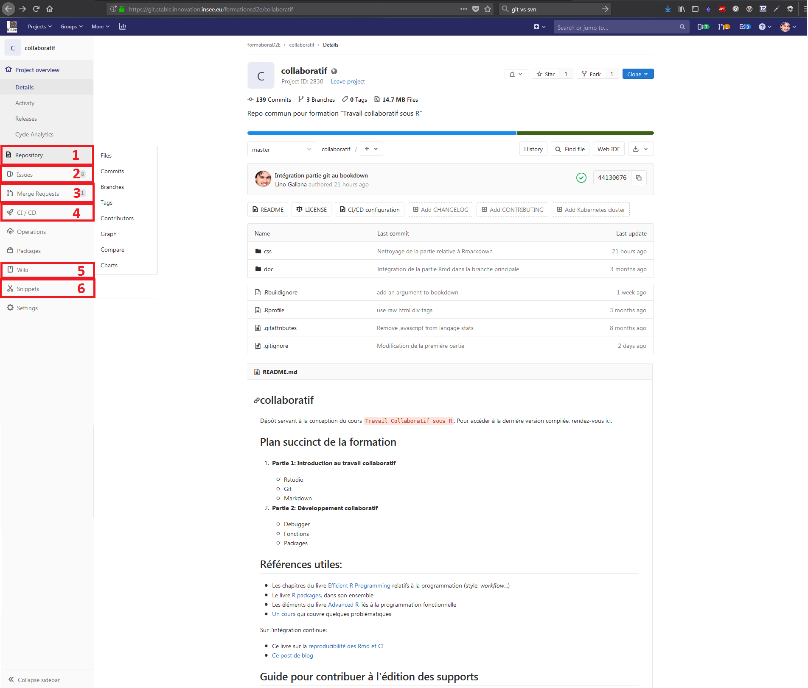

Le fichier `README.md` s'affiche automatiquement et il est mis en forme par défaut. Il présente des informations utiles pour la compréhension de l'objectif du projet, son installation, etc. On peut naviguer dans l'arborescence d'un dépôt facilement mais certains types de fichiers s'affichent mal (ex: `html` car ils n'ont pas vocation à être partagés).

Les principales fonctionnalités sont présentes dans les onglets d'un projet sous GitLab: 

1. `Repository`: le dépôt, c'est le centre du contrôle de version
2. `Issues`: espace de discussion, de suggestions ou demandes. 
3. `Merge Requests`: suggestion de modifications en proposant au(x) gestionnaire(s) du dépôt de fusionner des branches
4. `CI/CD`: espace dédié à l'<abbr title="pratique consistant à vérifier de manière  automatique à chaque modification de code source que les modifications n'introduisent pas d'erreur"><b>intégration continue</b></abbr> (cf. Section avancée ** sur le sujet)
5. `Wiki`: espace de documentation collaboratif séparé des fichiers du dépôt ([exemple](https://github.com/Rdatatable/data.table/wiki)). Cela implique que la documentation n'est pas associée à un fichier du dépôt. Il s'agit également d'un dépôt git.
6. `Snippets`: morceaux de code à conserver qui peuvent être utiles dans le futur.

Ce sont sur les trois premiers points que reposent l'immense majorité des fonctionnalités. 

### `Repository`

Le dépôt regroupe les principales fonctionnalités reliées au contrôle de version. Il indique les fichiers du projet et liste les commits par ordre chronologique. Le navigateur de fichier permet même de modifier /commiter directement en ligne. Pour un fichier donné, il permet d'afficher l'historique des modifications (en haut à droite). Il permet également de visualiser les branches et leur trajectoire et de les comparer entre elles avant de proposer une `merge request` (cf. ci-après).


### `Issues`

C'est l'espace de discussion du projet. Un [exemple sur le `GitHub` InseeFrLab](https://github.com/InseeFrLab/utilitR/issues). Par l'intermédiaire de différents sujets ou tickets, cet espace permet de :

* signaler des *bugs* (à la manière d'un *ticket*)
* discuter des évolutions d'un projet et proposer des changements
* évoquer des pistes de modifications qui sont à creuser

Ces échanges prennent la forme d'un forum où les sujets sont regroupés sous la forme d'*issues* (problèmes) qui peuvent être identifiées grâce à des labels. Un des avantages est de pouvoir intégrer des passages de code ou de faire des références croisées entre les issues.

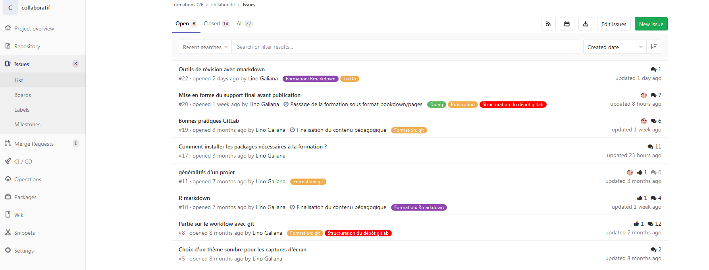

Pour ouvrir une nouvelle *issue*, par exemple pour discuter d'une modification avant de la proposer ou signaler un problème qu'on ne résoud pas immédiatement, on clique en haut à droite sur le bouton dédié :


Il ne faut pas hésiter à ouvrir des `issues` pour prévoir des modifications dans le futur, signaler des points à régler ou à avancer. C'est un outil efficace pour se répartir le travail et cela évite de nombreux échanges mail, avec l'avantage d'être archivé et visible par tous les contributeurs au projet (même ceux qui ne sont pas encore arrivés).

Un aspect très pratique est qu'il est possible de faire référence aux *issues* dans les messages de `commit` en utilisant le numéro de l'issue précédé du signe `#`, par exemple `#12`. Dans ce cas, automatiquement, `GitLab` affichera une référence au `commit` dans la page de l'*issue* (et le lien url cliquable associé ! ).

:::: {.conseil data-latex=""}
Il est possible de fermer automatiquement une *issue* en faisant précéder l'appel d'une *issue* par le terme `Closes`. Cela peut être fait dans un message de commit ou dans la description d'une *merge request*. Par exemple,

```shell
Le problème des données manquantes est réglé

Closes #12
```

fermera automatiquement l'*issue 12* sur la page sur `gitlab.com` du projet.

Il existe une astuce bien pratique pour automatiquement fermer une `issue` quand on travaille avec une branche. Si comme nom de branche, on donne `xx-blabla` où `xx` est le numéro de l'*issue*, alors au moment de la création de la *merge request*, le commentaire sera automatiquement alimenté par `Closes #xx`. Lorsque cette *merge request* sera validée, `#xx` sera automatiquement fermée.
::::

Enfin, il est possible d'avoir un affichage en tableau en cliquant à gauche sur `Boards` ou encore d'associer des *issues* à des `milestones` (jalons) qui sont des étapes permettant de suivre l'évolution d'un projet.


### Exercice 4 : Ouvrir et organiser les *issues*

Au début d'une tâche particulière ou d'un projet, il est recommandé d'ouvrir des *issues*. Prenant la forme d'un espace de discussion, elles correpondront à la fin à des nouvelles fonctionnalités (en anglais, _features_). Les *issues* permettent également de signaler des bugs constatés, de se les répartir et d'indiquer s'ils sont réglés ou s'ils ont avancés.

Ces *issues* seront fermées au fur et à mesure que les fonctionnalités seront implémentées ou bien que vous aurez abandonné vos idées. Des *labels* peuvent être utilisés pour classer les *issues*. Il est possible de les affecter à une personne en particulier, fixer une date de rendu, etc.

Tout se passe sur la page du projet `GitLab` (menu déroulant à gauche) :


:::: {.exo data-latex=""}
Exercice 2 : Premiers pas sur Gitlab

**Question a.** *Ouverture et attribution*

Ouvrir une *issue* concernant le fichier de votre voisin et indiquant qu'il faut corriger les majuscules et la ponctuation. Lui attribuer l'*issue* via `@idep`.

**Question b.** *Règlement*

Corriger votre fichier `votre-idep.md` par un `commit` puis un `push`.

**Question c.** *Clôture*

Vérifier via un `pull` que votre voisin a corrigé son texte et clôturer l'*issue* sur `GitLab`.

::::

### Merge requests (MR)

C'est l'espace pour gérer des fusions de branches, c'est-à-dire le fait de transmettre à la branche commune des modifications en les validant. Cela peut venir à la suite : 

* d'une ou plusieurs *issues* qui ont été créées et discutées
* d'une création de branche afin de propose de l'intégrer 

`GitLab` facilite énormément le travail de fusion de branches (MR). Si les modifications proposées sont faites avec méthode, cela évite le passage fastidieux par la ligne de commande.  Pour créer une nouvelle *merge request*, on clique en haut à droite sur `New Merge request`. On sélectionne ensuite la branche `source` (celle où on a fait les modifications) et la branche `target` (celle qu'on veut modifier)


On clique sur `Compare branches and continue` pour arriver sur la page permettant de décrire la `merge request`. On aide le(s) gestionnaire(s) du projet en faisant en sorte d'être explicite sur l'objectif de la `merge request`. On peut notamment faire référence à des *issues* comme `#19` dans l'exemple ci-dessous. On donne un titre explicite à la merge request en ajoutant le préfixe `WIP:` si celle-ci n'est pas encore finalisée (permet de mentionner précocément au gestionnaire qu'on avance sur le développement d'une branche)

Une bonne pratique est de proposer les options suivantes:

* `Delete source branch when merge request is accepted`: effacer la branche sur le dépôt commun pour éviter que quelqu'un l'édite alors qu'elle n'est plus d'actualité.
* `Squash commits when merge request is accepted`: Regrouper tous les `commits` (potentiellement très nombreux dans l'ancienne branche) en un seul dans la branche de destination. Cela évite, sur les **gros projets**, des branches avec des milliers de *commits*. Pour les petites modifications, c'est-à-dire les branches avec peu de `commits`, on peut éviter cette option et laisser l'historique dans la branche fusionnée.

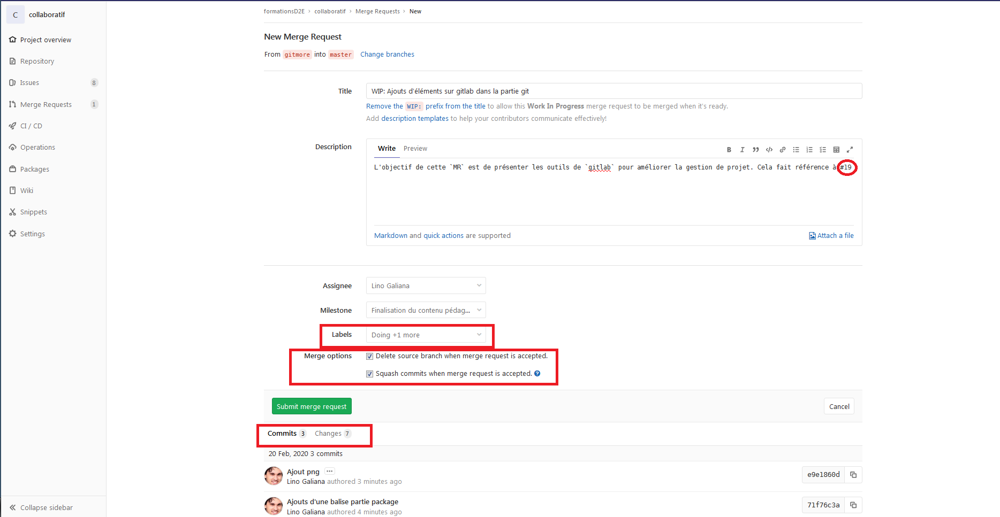

Vous pouvez voir, en dessous, les changements induits si la MR est acceptée. Lorsque la `MR` est soumise, `GitLab` inspecte les conflits entre les fichiers. S'il n'y a pas de conflit, la `MR` peut être acceptée directement depuis `GitLab` en cliquant sur le bouton vert `Merge`:

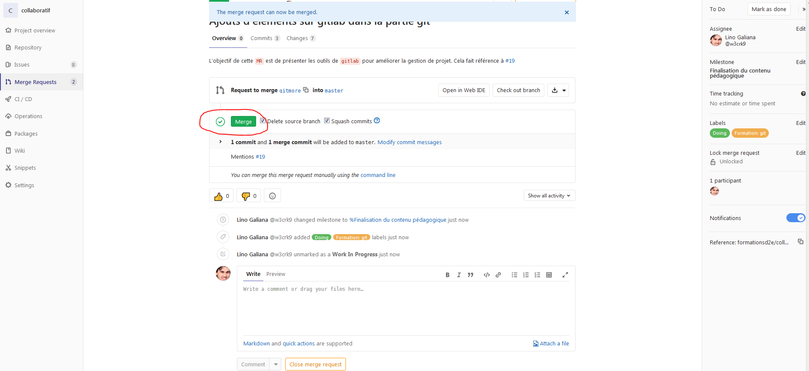

En cas de conflit, `GitLab` refuse le `merge` automatique et propose des commandes:

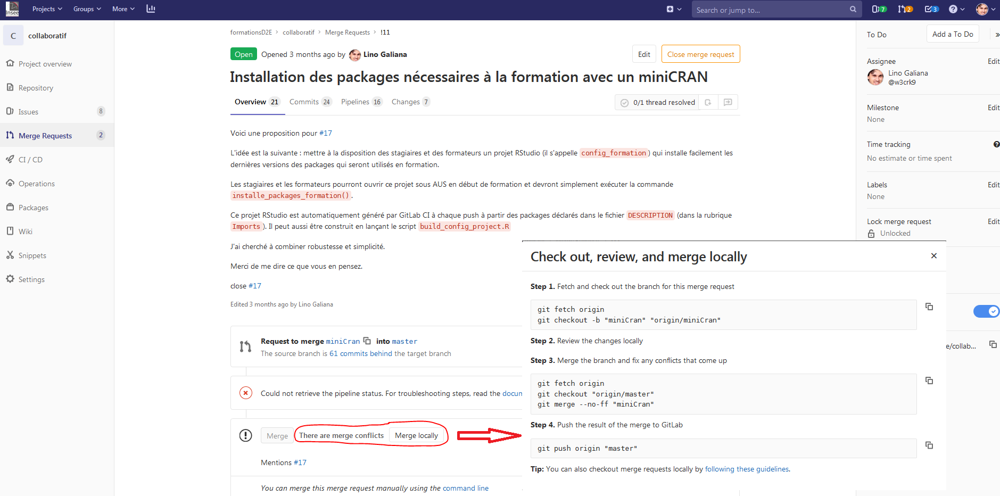

Il y a deux philosophies dans le domaine:

* C'est à la personne qui propose la `merge request` de proposer une copie propre
* C'est au(x) gestionnaire(s) de nettoyer et harmoniser 

Les gros projets *open-source* fonctionnent plutôt de la première manière. Il s'agit de la pratique la plus prudente. 

Dans des cas rares, vous vous devez passer par la ligne de commande pour des MR. Suivez précisément les indications du `merge locally` et n'oubliez surtout pas l'option `--no-ff` lors de l'étape de `merge` sans quoi vous réécrirez l'historique ce qui peut endommager votre dépôt. 

La logique générale pour les étapes de `merge locally` est la suivante : 
1. On met à jour la branche locale cible `origin` (possible aussi via les menus `RStudio` en faisant un `pull`) puis on passe sur la branche source (là où sont les changements qu'on veut transmettre).
2. On sélectionne **à la main** les modifications dans les programmes par l'intermédiaire des `HEAD` qui sont apparus dans les codes.
3. On applique les lignes de commande de l'étape 3 (en ligne de commande avec précaution).
4. On transmet au dépôt partager avec un `push` (possible via les menus `RStudio`).


:::: {.recommandation data-latex=""}
Le rôle de gestionnaire des `merge request` dans un projet collaboratif est important. Il faut **absolument** bannir les usages de `push force` qui peuvent déstabiliser les copies locales des collaborateurs. S'il est nécessaire de faire un `push force`, c'est qu'il y a un problème dans la branche, à identifier et régler **sans** faire `push force`


::::


### Exercice 4 : Fusionner les travaux avec des `Merge Requests`

Les `merge requests` (MR) sont sans doute la fonctionnalité la plus pratique. En ouvrant une MR, il est crucial de :

- donner un titre explicite (comme on donne un objet à un mail);
- donner des détails dans le message (comme pour les `commit`).

Le cas échéant, il est très pratique d'ajouter dans le corps du message `close #xx` où `xx` est le numéro de l'*issue* décrivant la fonctionnalité que la `MR` implémente. Lorsque la `MR` sera fusionnée, l'*issue* sera automatiquement fermée et un lien sera créé entre l'*issue* et la `MR`. Cela vous permettra de comprendre, plusieurs mois ou années plus tard, comment et pourquoi telle ou telle fonctionnalité a été implémentée.

Une fois une `MR` ouverte, il est précieux de solliciter une relecture. En effet, personne ([même les meilleurs!](https://twitter.com/hadleywickham/status/589068687669243905)) n'est à l'abri d'une erreur. 

**Les merge requests sont des espaces de discussion**. Vous pouvez commenter une proposition de modification en particulier ou bien suggérer une modification.

Lorsqu'elles sont acceptées, les suggestions sont appliquées au moyen d'un commit. Cela permet une parfaite traçabilité des modifications.

:::: {.exo data-latex=""}
Exercice 4 : Merge Request


**Question a.** *Ouvrir une MR*

Créez une `merge request` dans GitLab. Dans cette `merge request`, vous devez proposer d'ajouter à la branche `master` du dépôt commun les modifications qui ont été développées dans la branche que vous avez créée au cours de l'exercice 2. Autrement dit, vous proposez d'ajouter au fichier `cadavre_exquis.md` les deux phrases que vous avez écrites dans votre branche, et que votre voisin a corrigées.

**Question b.** *Contribuer à une MR*

Dans GitLab, allez dans la `merge request` créée par votre voisin, et contribuez à la discussion par un message donnant votre avis sur les modifications proposées.
**N'acceptez pas les MR, c'est l'objet du prochain exercice**

<!---
**Question c.** *Régler une MR*

Dans GitLab, fusionnez la branche de votre voisin avec la branche `master`. Retournez dans Rstudio. Placez-vous sur la branche `master` de votre dépôt local, puis récupérez depuis le dépôt commun les modifications apportées à cette branche (avec `pull`). Ouvrez le fichier `cadavre_exquis.md`. Vous devez normalement constater que le fichier contient désormais les phrases que vous et votre voisin avez écrites.
----->

::::

Usuellement, c'est la seule responsabilité spécifique des mainteneurs :
seuls eux peuvent fusionner dans `master`. Il leur appartient de veiller à la
bonne qualité des `merge requests`.

Gitlab propose deux options lors du *merge* : 
* `Delete source branch when merge request is accepted`: supprimer la branche. C'est fortement recommandé car cela évite qu'un contributeur reprenne, après plusieurs mois d'inactivité d'une branche, qui aurait accumulé du retard par rapport à `master`, une branche. 
* `Squash commits when merge request is accepted`: Là, vous devrez faire preuve de discernement. L'habitude est de faire des `squash and merge` (pratique la plus largement répandue). Cependant, il peut y avoir des cas où vous préférerez conserver l'historique des commits (c'est plus rare). Très franchement, ce sujet n'est pas le plus important.

### Les groupes


Quand un projet est important, on peut créer un groupe qui permet d'avoir une arborescence de dossiers:

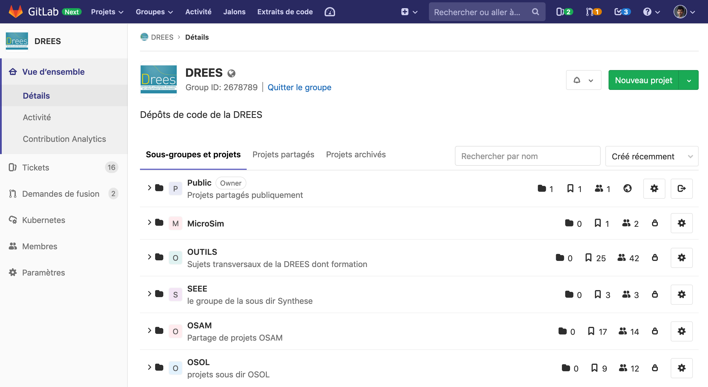{width=100%} 

## Organiser le travail collaboratif {#orgagit}

Les outils de gestion de version permettent des usages multiples afin d'organiser efficacement la collaboration. Cette section propose une synthèse des usages de `Git` dans la communauté `R`, adaptés à fois à la configuration à l'Insee et au mode de travail des statisticiens.

:::: {.remarque data-latex=""}

Cette formation adopte le parti pris de suivre le `GitHub Flow` dont une rapide description peut être trouvée sur [cette page](https://guides.github.com/introduction/flow/) et qui a pour mérite d'être le plus simple.  

En effet, des habitudes se sont imposées peu à peu dans la
communauté R, essentiellement au travers des collaborations sur la plateforme
`GitHub` (plateforme de gestion de code similaire à GitLab). Ces usages, semblables à des normes sociales, vous permettront d'acquérir une certaine maîtrise de `Git`. Ensuite, au fur et à mesure de l'avancée de vos projets, vous pourrez adapter plus finenement ce fonctionnement à vos besoins et exploiter les nombreuses possibilités offertes par le contrôle de version. Cela n'est absolument pas gênant, à partir du moment où vous comprenez ce que vous faites.

Vous devez savoir qu'il y a plusieurs méthodes de travail avec `git` (_flow_, en anglais). Vous pourrez trouvez des dizaines d'articles en ligne et d'ouvrages sur ce sujet dont chacun prétend avoir trouvé la meilleure organisation du travail (`Git flow`, `GitHub flow`, `GitLab flow`...). Ne lisez pas trop ces livres ou articles sinon vous serez perdus (un peu comme avec les magazines destinés aux jeunes parents ou les conseils pour devenir millionnaires).
::::

Voici la marche à suivre lors de la création d'un nouveau projet :

- Vous devez identifier les responsables de la maintenance du projet. Dans `GitLab`, c'est facile, c'est le rôle de _Mainteneur_ (droits d'écriture sur `master`).
- Chaque mainteneur a une responsabilité identique et élevée : n'accordez pas les droits de mainteneur sur votre repository à la légère, vous pourriez le regretter.
- C'est au(x) mainteneur(s) du <abbr title="Dossier partagé qui contient toutes les informations"><b>repository</b></abbr> de définir les règles d'organisation du travail (ici, ce sera le `GitHub flow`).
- Idéalement, ces règles doivent être précisément décrites dans un fichier nommé `CONTRIBUTING.md` placé à la racine du projet. Il permettra à toute personne rejoignant le projet en cours de route de comprendre les différentes modalités de contribution.
- Il est essentiel que chaque personne qui contribue au projet se conformer à ces règles.


`Git` est un outil puissant et flexible, adaptable à un grand nombre d'organisation du travail.
Dès lors, les problèmes rencontrés ne sont généralement pas liés à `Git`
mais à une mauvaise définition en amont de l'organisation du travail ou bien
à son non-respect par les mainteneurs. 

L'expérience enseigne que si vous n'avez pas réfléchi à l'organisation du travail,
il est à peu près certain que vous rencontrerez des problèmes.
Des difficultés peuvent en particulier apparaître dans une
équipe dont personne n'aurait d'expérience avec `Git`. Grâce aux fonctionnalités
de `Gitlab`, toutes les contributeurs d'un projet n'ont pas besoin de connaître
`Git`. Néanmoins, il est mieux que ceux ayant la responsabilité la plus élevés, à savoir
les droits d'écriture dans `master`, aient des connaissances en `Git` pour
ne pas mettre en péril un projet par une manipulation hasardeuse
(ça n'arrive pas souvent et il y a des filets de sécurité avant de le faire).


Pour les modifications quotidiennes,
il est possible d'effectuer un `commit` sur `master`.
Cela est possible si dans l'organisation du travail, vous avez les droits
de type _Mainteneur_. Le premier exercice [**`Git` en local**](#gitlocal) en
donne un exemple. Cependant, pour des changements plus profonds ou 
avec des collaborateurs moins réguliers, il est recommandé d'organiser le
 travail selon les cinq étapes suivantes.

### Créer une branche

Une branche permet de développer "dans son coin" (seul ou à plusieurs) et d'expérimenter des modifications et des améliorations avant de les proposer au dépôt commun.

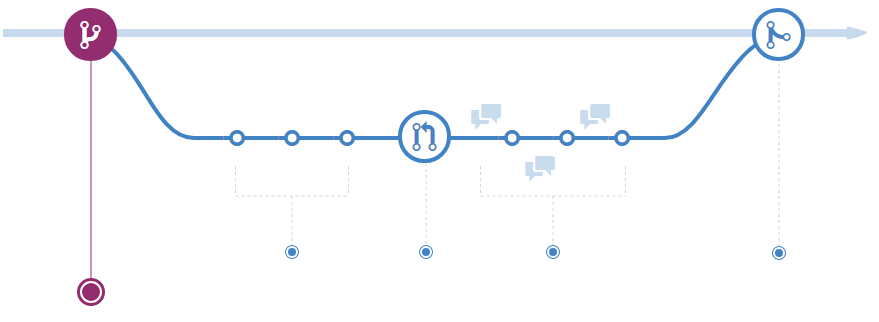

### Modifier et valider ces changements 

C'est l'étape des `commits`. Le travail se fait sur la branche en veillant à bien commenter les modifications et à bien les distinguer (il vaut mieux trop de `commit` que pas assez). 

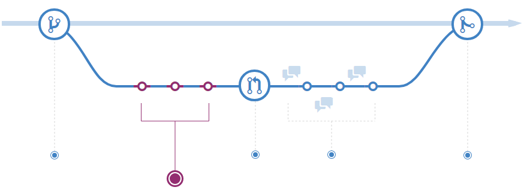

### Ouvrir une demande de fusion 

Une fois la série de modifications terminée ou le temps venu de rassembler les différents travaux, c'est par l'intermédiaire de la fusion entre la branche et le `master` (`Pull Request` sur `GitHub` ou `Merge Request` sur `GitLab`). Il faut alors "demander" de fusionner et c'est très bien intégré dans l'environnement `GitLab` (cf. ci-après). Cela initie un échange sur les modifications apportées.

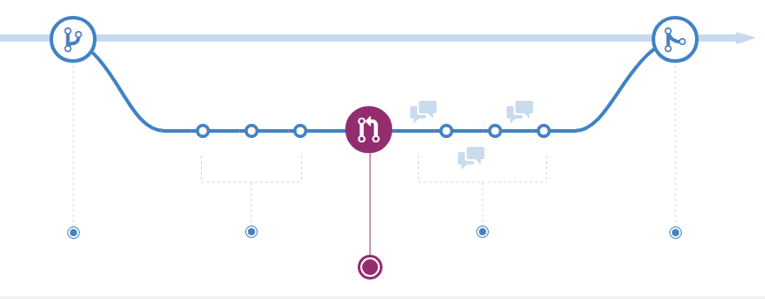

### Échanger entre collaborateurs et vérifier le code

Une fois la `Merge Request` ouverte, il est possible d'échanger des images, de commenter, de poser des questions et d'y répondre. Il est par exemple possible de mentionner un membre de l'équipe par l'intermédiaire de `@personne`.


### Fusionner la branche avec `master`

Une fois les vérifications faites, la fusion conserve l'historique des modifications et l'ensemble des `commits`.

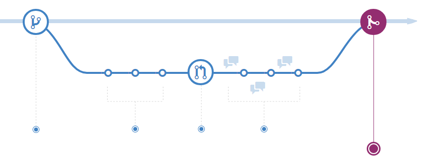


### Exercice 5 : Résoudre les conflits, c'est facile.

Si vous adoptez les règles précédentes, `master` sera surtout modifié via des `merge requests`. Vous ne devriez donc jamais avoir de conflits sur master.

Tous les conflits devraient donc survenir dans les branches. Les `merge requests` en conflit sont impossibles à merger. Il n'y a donc pas de possibilité de commettre un erreur par mégarde (c'est la raison pour laquelle il est interdit de merger dans master localement).

Si votre branche est en conflit, **le conflit doit être résolu dans la branche et pas dans master**. Voici la marche à suivre :

- appliquez le conseil de survie : faites une copie de sauvegarde de votre clone (avec l'expérience, vous pourrez vous passer de cette étape)
- dans votre clone, placez vous sur la branche en question `git checkout nom-de-la-branche`
- mergez master dans la branche `git merge master`
- résolvez les conflits
- finalisez le commit de merge
- poussez vers GitLab

Rappel : **Il est interdit de faire l'inverse (merger localement la branche dans master)**

:::: {.exo data-latex=""}
Exercice 5 : Gérer des conflits dans une branche

**Question a.** Revenez sur la branche `master`. Vous êtes subitement atteint
d'une double personnalité 😵
et oubliez que vous avez déjà proposé des changements. 
Vous ouvrez une branche. Refaire l'exercice 3
(questions `a` à `d`) avec une branche nommée `nom-prenom-double` et ouvrir une
*merge request*. 

**Question b.** Vous revenez tous deux à votre état normal. Sur `Gitlab`, une première personne
valide sa *merge request*

**Question c.** En local, vous faites tous deux un `pull` pour récupérer la modification
du dépôt:

* La personne qui n'a pas fait le `merge` de sa branche se place sur sa branche. Elle doit mettre à jour
sa branche pour tenir compte des modifications de `master`:
    + Il faut taper dans l'invite de commande `git merge master` 
    + Un conflit doit apparaître: il se résout en éditant directement le fichier. Ne pas supprimer la phrase
de votre camarade mais accoler votre texte à celle-ci

* La personne qui a fait le `merge` retombe dans sa deuxième personnalité et se place dans sa branche `*-double`. Elle doit mettre à jour
sa branche `*-double` pour tenir compte des modifications de `master`:
    + Il faut taper dans l'invite de commande `git merge master` 
    + Un conflit doit apparaître: il se résout en éditant directement le fichier. Ne pas supprimer la phrase
de votre première personnalité mais accoler votre nouveau texte à celle-ci

**Question d.** Sur Gitlab, valider la *merge request* de la personne qui n'a pas eu de MR validée jusqu'à présent.
Regarder dans l'interface Gitlab, le fichier `cadavre_exquis.md`

**Question e.** Retour dans la deuxième personnalité aussi pour la deuxième personne. Chacun sur sa branche `-double`, suivre
la procédure de nettoyage du conflit pour être raccord avec `master`. La personne la plus rapide à régler le conflit valide sa
*merge request*, la suivante devra à nouveau harmoniser sa version avec `master`

::::


### Exercice 6 : Contribuer à un dépôt sans droits sur `master`


À l'issue de cet exercice, vous devriez avoir un premier cadavre exquis. Pour garder trace de ces monuments de littérature, vous allez les 
soumettre au dépôt d'exemple. Il est tout à fait possible de soumettre des modifications à un dépôt sur lequel on n'a pas le droit d'écriture
par l'intermédiaire d'un `fork`:

:::: {.exo data-latex=""}
1. Se trouver un nom de groupe qui va servir à nommer le fichier. 
L'une des personnes du groupe crée une branche `finalisation`. Elle se place dessus et change le nom du `cadavre-exquis.md`. Par exemple, si vous avez décidé d'être l'équipe Oulipo, nommer le fichier `oulipo.md`
2. Ne pas oublier de faire add, commit, push 
3. Dans le dépôt d'[exemple](https://gitlab.com/linogaliana/template-projet), ouvrir une `merge request` en mettant votre dépôt et la branche `finalisation` dans la partie `Source branch` . Remplir la *merge request*


::::

:::: {.recommandation data-latex=""}
Faire une *merge request* via la branche `master` d'un `fork` est très mal vu. En effet,
il faut souvent faire des contorsionnements pour réussir à faire coïncider deux histoires
qui n'ont pas de raison de coïncider.
[L'aide officielle de `GitHub`](https://gist.github.com/Chaser324/ce0505fbed06b947d962#submitting-a-pull-request)
recommande de faire un `rebase`: souvenez-vous, on vous a dit que c'était mal de faire ça ! On s'évite beaucoup
de peine (et on évite une grosse galère au mainteneur du dépôt forké) en évitant simplement de faire le
merge depuis son propre `master`. L'astuce de le faire depuis une branche différente fonctionne très bien.
::::

