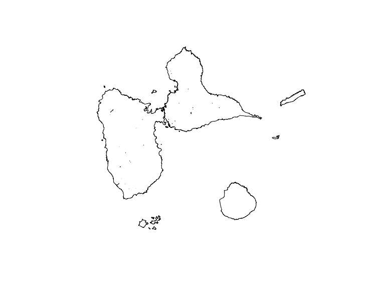
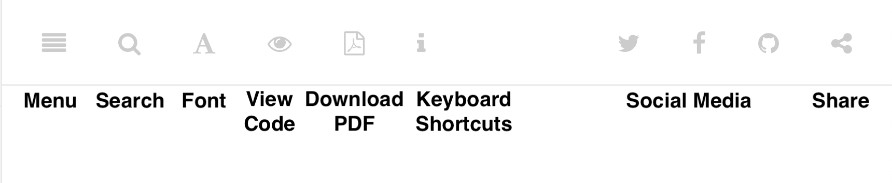

--- 
title: "Résumé des cours et TP - DU Dataviz"
author: ["Romuald ZAMI", "et contributeurs"]
date: "2022-06-14"
knit: "bookdown::render_book"
site: bookdown::bookdown_site
documentclass: book
bibliography: [book.bib, packages.bib]
biblio-style: apalike
link-citations: yes
description: "Support à destination des R-newbies"
---

# Préface {-}

Je me suis aussi inspiré de ce qui est déja produit. Reprendre un travail déja effectué n'est pas une mauvaise chose, il faut s'en `inspirer` et le faire évoluer en y apportant toutes les modifications necessaire afin que le rendu soit comme **on** le souhaite.

## Contributeurs <i class="far fa-user-secret"></i>  {-}

Vous trouverez ci dessous l'ensemble des personnnes ayant contribués à la création  de ce document : 

|  | Auteur principal |
| :-- | :---------- |
|  | Romuald ZAMI, Chargé d'étude statistique au sein de la direction du pilotage, de la performance et l'organisation du travail à la direction générale de pôle Emploi. En parallèle , étudiant en DU Dataviz à l'[IUT de Paris - Rives de Seine](https://iutparis-seine.u-paris.fr/metiers-de-la-data/diplome-duniversite-dataviz/). Vous pouvez me suivre sur [Twitter](http://twitter.com/Rom@Zam).
|  | **Co-Auteurs** |
|  | Jonathan El Methni (Maître de Conférence à l'Université Paris Descartes) responsable du DU DATAVIZ 2021-22. Département Statistique et Info Décisionnelle (STID)Paris, France. |

**Contributeurs additionnels**

  - _Citer tous les professeurs du DU..._

Ainsi que mes deux collègues Yohan et Nicolas <i class="far fa-user-friends"></i> .

## Utilisation des icônes {-}

A partir de votre navigateur, vous pourrez utiliser les icones suivantes:

- Menu
- Search
- Font to adjust text size and display
- View source code on GitHub
- Download PDF
- Shortcuts (arrow keys to navigate; `s` to toggle sidebar; `f` to toggle search)
- Social Media
- Share

